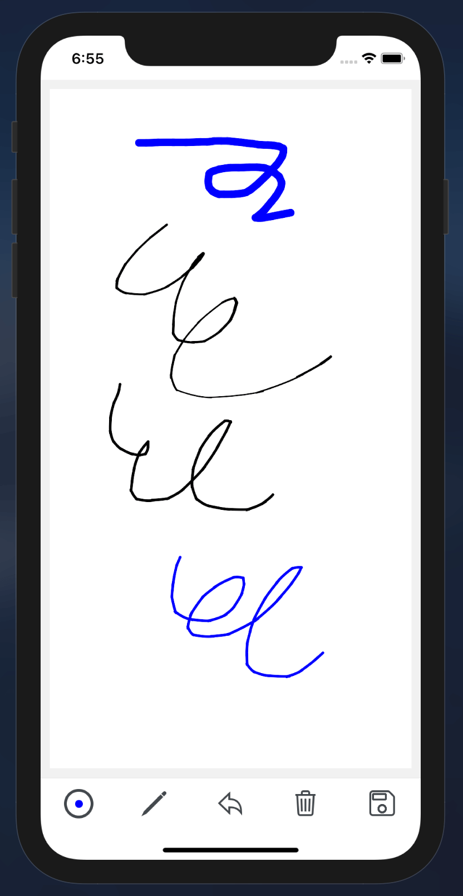
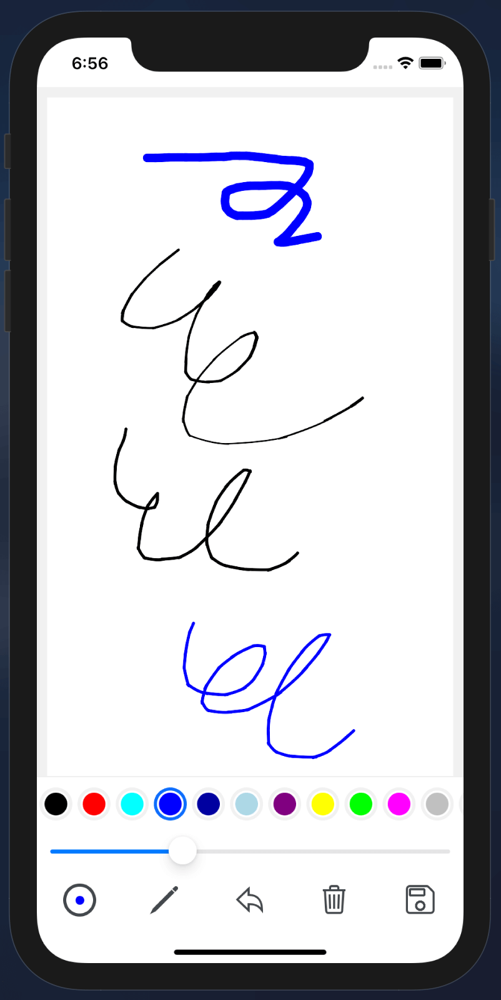

# react-native-sketchpad

react native sketchpad

&nbsp;&nbsp;

## Installation

```sh
npm install react-native-sketchpad
```

## Usage

[example](example/src/App.tsx)

```js
import Sketchpad, { SoftBrush, HardBrush } from "react-native-sketchpad";

// ...
function App() {
  const pad = useRef();
  const brush = new SoftBrush(3, 7);
  const onClear = () => {
    pad.current?.clear();
  };
  const onUndo = () => {
    pad.current?.undo();
  };
  const onSave = () => {
    pad.current?.toDataURL((base64) => {
      // do save image
    });
  };
  return (
    <Sketchpad ref={pad} style={styles.pad} brush={brush} />
  );
}
```

## Contributing

See the [contributing guide](CONTRIBUTING.md) to learn how to contribute to the repository and the development workflow.

## License

MIT
